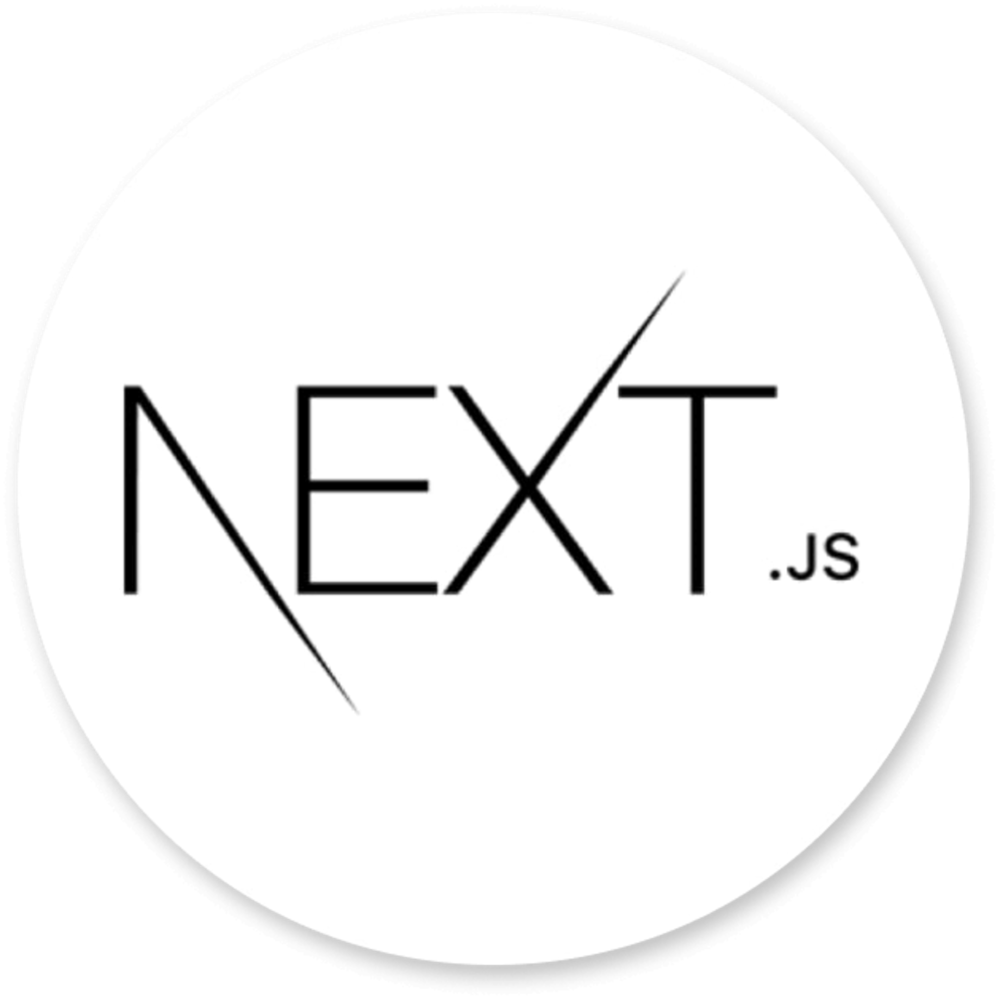
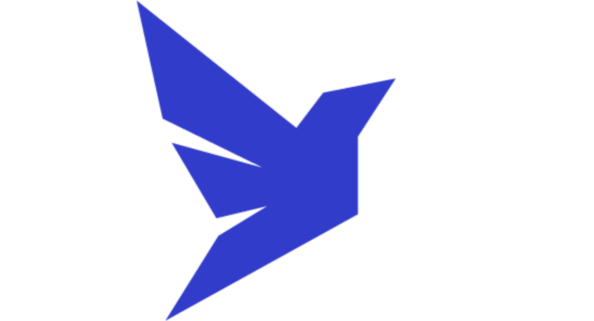

<h1 align="center" class="line-1 anim-typewriter"> NOME DO PROJETO</h1>

<div align="center">
         
        
</div>

<br/>

<div align="center"  class="links">
        <a href="#challenge">challenge</a> |
        <a href="#built_with">built with</a> |
        <a href="#author">author</a> |
        <a href="#license">license</a> 
</div>

<br/>
<br/>

<h2 id="challenge"  align="center">⚡ The challenge </h2>

<div align="center">
        <p>
        project built during the rocketseat ignition stroke. This is a Blog where only people who are subscribers can access the full content, using Stripe's payment services. Blog posts are created via a headless cms and user authentication via Github.
</p>
</div>

<br/><br/>

> <h3> Links : </h3>

Why use nextJS... [Learn More](https://nextjs.org/learn/foundations/about-nextjs/what-is-nextjs#:~:text=js%3F-,Next.,and%20optimizations%20for%20your%20application. "Clique para ser redirecionado!").

ReactJS: A JavaScript library for creating interfaces ... [Learn More](https://pt-br.reactjs.org/ "Clique para ser redirecionado!")

<br/><br/>

<h2 id="built_with"> 🧙‍♂️ Built with</h2>

<br>

<div id="react-js">
 
    <p align="left"><code><b>ReactJS</b></code></p> 
</div>

<div id="next-js">
        
        <p align="left"><code><b>NextJS</b></code></p>
</div>

<div id="prismic-cms">
        
        <p  align="left"><code><b>Praismic CMS</b></code></p>
</div>

<div id="faunadb">
    
    <p  align="left"><code><b>FaunaDB</b></code></p>
</div>

<div id="axios">
        
        <p align="left"><code><b>Axios</b></code></p>
</div>

<div id="stripe">
    
    <p  align="left"><code><b>Stripe</b></code></p>
</div>

<br/>
<br/>
<br/>
<br/>

> <h3> Getting start : </h3>
> <br/>

<div>

1. <b>Clone the project</b>

```bash
  $ git clone URL DO PROJETO && cd NOME DA PASTA DO PROJETO
```

2. <b>Install dependencies</b>

```bash
  $ expo install
  $ yarn add or npm install
```

3. <b>Start the application</b>

```bash
  $ expo start
  $ yarn start or npm start
```

</div>

<br>

<h5 id = "author" align="center"></h5>

<table align="center">
  <tr>
      <td>
      <a href="https://github.com/gabriel-durr">
        <br>
      </a>
      </td>
  </tr>
</table>

<div align="center">
        <sub><b><em>Made with 💜&ensp; by Gabriel Dürr </em></b></sub>
</div>

<br/>
<br/>
<br/>

<h2></h2>

<div align="center">
        
<h3 id="license" ></h3>

> This project is licensed under the &nbsp; [](LICENSE)

</div>
